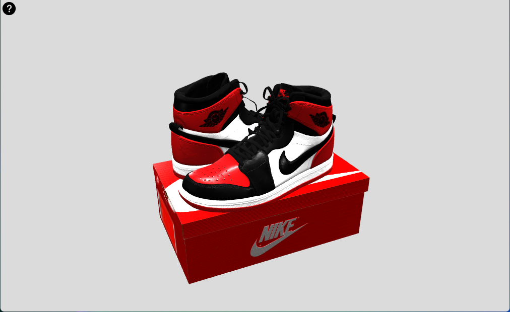

# 3D Object On WebPage

[](https://developer.mozilla.org/en-US/docs/Web/Guide/HTML/HTML5)
[](https://developer.mozilla.org/en-US/docs/Web/CSS)
[](https://developer.mozilla.org/en-US/docs/Web/JavaScript)
[](https://threejs.org/)

<p align="center">
  
</p>

## Link 👉  https://pablo736.github.io/3D-Object-WebPage/

## Description
The project is a simple web application that allows users to view a 3D model on a web page. It uses the Three.js library to create and render 3D graphics in a browser.

## How to Use

1. Clone the repository to your local machine using the following command:

```bash
   git clone https://github.com/Pablo736/3D-Object-WebPage.git
```

2. Open the `index.html` file in your web browser.

## License
This project is licensed under the GNU General Public License v3.0. See the `LICENSE` file for more details.